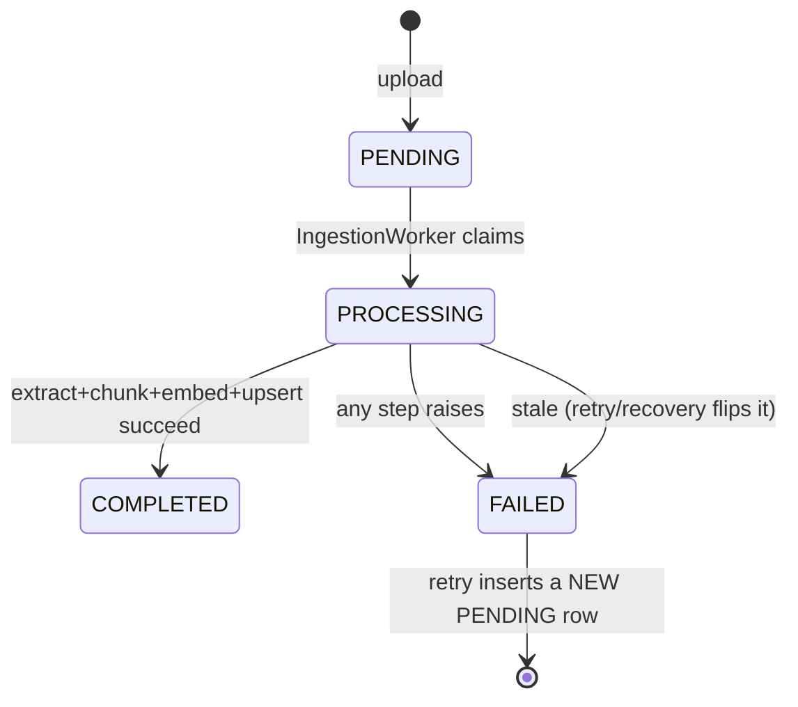
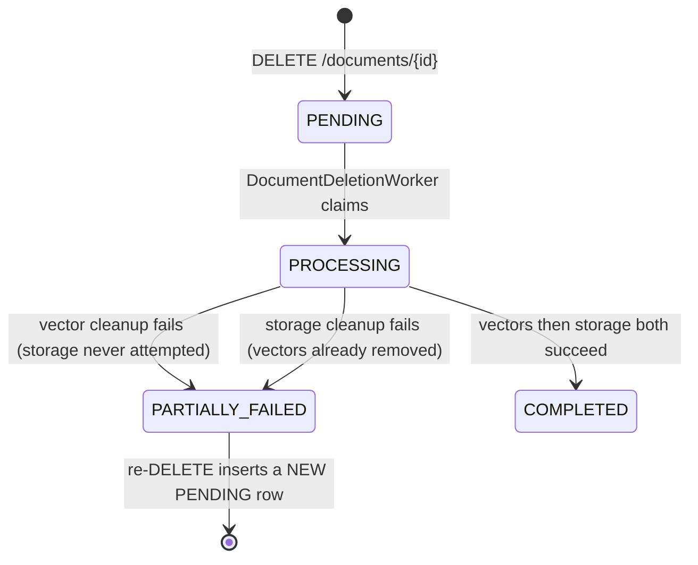
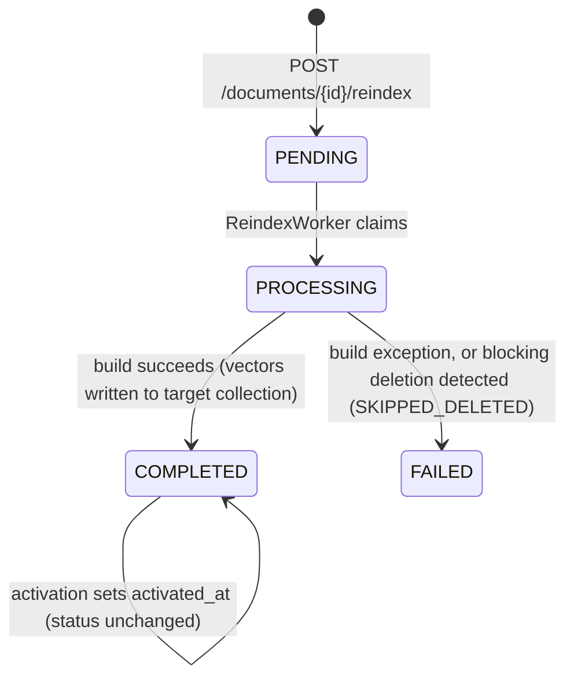
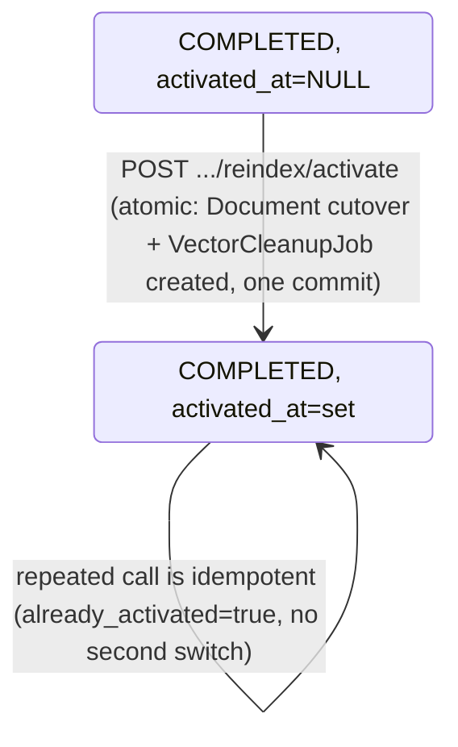
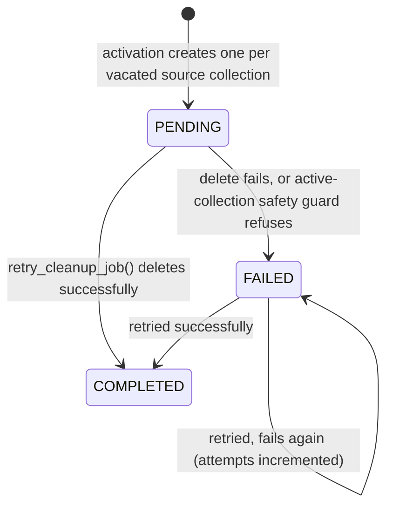

# Document Lifecycle

**Canonical source for every lifecycle state machine, transition table, and API contract in this
repository.** Other documentation directories link here rather than redefining any of this —
if you find a lifecycle state or transition described elsewhere, that description should be a
link back to this page, not an independent definition.

This page covers five distinct, separately-modeled lifecycles:

1. [Document lifecycle](#1-document-lifecycle) (derived status)
2. [Ingestion job lifecycle](#2-ingestion-job-lifecycle)
3. [Deletion job lifecycle](#3-deletion-job-lifecycle)
4. [Re-index job lifecycle](#4-re-index-job-lifecycle-build) and [activation](#5-activation)
5. [Vector cleanup job lifecycle](#6-vector-cleanup-job-lifecycle)
6. [Reconciliation / audit](#7-reconciliation--audit-lifecycle) (read-only, not a state machine)

All job tables share one design: **append-only**, at most one active
(`PENDING`/`PROCESSING`) row per document per job type, enforced by a **Postgres partial unique
index** — never application logic alone.

---

## 1. Document lifecycle

`Document.status` is not a persisted column — it is **derived** on every read from the document's
latest job rows, in this precedence order (highest first):

| Precedence | Source | Derived status |
|---|---|---|
| 1 (highest) | Latest `DocumentDeletionJob` = `PENDING`/`PROCESSING` | `deleting` |
| | Latest `DocumentDeletionJob` = `PARTIALLY_FAILED` | `deletion_failed` |
| | Latest `DocumentDeletionJob` = `COMPLETED` | `deleted` |
| 2 | (no deletion job) Latest `IngestionJob` = `COMPLETED` | `indexed` |
| | (no deletion job) Latest `IngestionJob` = `FAILED` | `failed` |
| | (no deletion job) Latest `IngestionJob` = `PROCESSING` | `processing` |
| | (no deletion job) Latest `IngestionJob` = `PENDING` | `pending` |
| | (no deletion job) no `IngestionJob` at all | `uploaded` (defensive only — unreachable via the normal upload flow) |

**Once a document is `deleted`, nothing about its unchanged `collection_name`/`indexed_at`/
`IngestionJob` columns can make it look indexed again** — the deletion job is authoritative from
that point on. A deleted document remains listed/inspectable (`GET /documents`, `GET /documents/{id}`)
— read APIs never filter it out.

Computed by `derive_lifecycle_status()` in `app/services/documents/query_service.py`.

## 2. Ingestion job lifecycle

**States:** `PENDING` → `PROCESSING` → `COMPLETED` | `FAILED`. Terminal: `COMPLETED`, `FAILED`.

- **Transition ownership:** upload creates `PENDING`; `IngestionWorker.process_next_job()`
  (`app/services/ingestion/worker.py`) claims via `SELECT ... FOR UPDATE SKIP LOCKED`, flips to
  `PROCESSING` (committed before any I/O), then to `COMPLETED`/`FAILED`.
- **Retry** (`app/services/ingestion/retry_service.py`, `POST /documents/{id}/ingestion/retry`):
  inserts a brand-new `PENDING` row; never resets/deletes the old one.
- **Stale recovery** (`app/services/ingestion/stale_recovery_service.py`,
  `scripts/recover_stale_ingestion_jobs.py` only — no HTTP endpoint): a `PROCESSING` row whose
  `updated_at` is older than `INGESTION_STALE_AFTER_SECONDS` (default 900s, an approximation, not
  a liveness proof) is flipped to `FAILED` and a fresh `PENDING` replacement is created, in the
  same commit.
- **Idempotency:** point IDs are deterministic per document/chunk (`uuid5` of `chunk_id`), so a
  retry's successful upsert overwrites rather than duplicates — no cleanup mechanism needed.
- **One active row per document**, enforced by partial unique index
  `ix_ingestion_jobs_one_active_per_document` (`WHERE status IN ('pending','processing')`).
- **Deleted-document guard:** any `DocumentDeletionJob` existing at all blocks retry with `409` —
  a document is never implicitly resurrected.

## 3. Deletion job lifecycle

**States:** `PENDING` → `PROCESSING` → `COMPLETED` | `PARTIALLY_FAILED`. Terminal: `COMPLETED`.
`PARTIALLY_FAILED` is retryable (a fresh `PENDING` row), not terminal in the append-only sense.

- **Scheduling** (`app/services/documents/deletion_service.py`, `request_document_deletion()`):
  inserts `PENDING`; never performs cleanup inline.
- **Execution** (`app/services/documents/deletion_worker.py`, `DocumentDeletionWorker`,
  out-of-band via `scripts/process_pending_document_deletions.py`):
  1. Claim (`SELECT ... FOR UPDATE SKIP LOCKED`), commit `PROCESSING` before any I/O.
  2. **Vectors before storage, always.** Calls
     `delete_all_tracked_document_vectors()` (never the partial `delete_current_document_vectors()`)
     — resolves *every* collection the document's vectors could exist in (current + historical
     cleanup-pending + completed re-index targets), deduplicated, each attempted independently.
     A failure here marks `PARTIALLY_FAILED` and **returns before storage deletion is ever
     attempted** — enforced structurally, not just documented.
  3. On full vector success: `vector_cleanup_completed=True`, then `FileStorage.delete()`. A
     failure here marks `PARTIALLY_FAILED` with `storage_cleanup_completed=False`.
  4. Only when both steps succeed: `COMPLETED`, `completed_at` set.
- **Retry is append-only, not resumable-in-place** — a fresh attempt re-runs both steps from
  scratch (safe: both are independently idempotent).
- **One active row per document**, partial unique index `ix_document_deletion_jobs_one_active_per_document`.
- **Blocks/is blocked by:** an active `IngestionJob` or active `ReindexJob` blocks a new deletion
  (`409 INGESTION_ACTIVE` / `409 REINDEX_ACTIVE`) — deletion never races an in-flight write.
- **Content-hash release** (dedup): `Document.content_hash` is cleared to `NULL` only in the same
  commit as `COMPLETED` — never on `PENDING`/`PROCESSING`/`PARTIALLY_FAILED` — so identical bytes
  can only be re-uploaded as a genuinely new document once deletion has *fully* finished. See
  [docs/document-lifecycle/README.md#8-deduplication](#8-deduplication-not-a-job-lifecycle).
- **No stale-`PROCESSING` recovery exists for deletion** — unlike ingestion, a
  `DocumentDeletionWorker` crash mid-`PROCESSING` leaves that row stuck indefinitely. This is a
  documented, deliberate scope boundary (see [Current Limitations](#current-limitations)), not an
  oversight.

## 4. Re-index job lifecycle (build)

**States:** `PENDING` → `PROCESSING` → `COMPLETED` | `FAILED`. Terminal: `COMPLETED`, `FAILED`.
`COMPLETED` means **only** "the pinned target build succeeded" — never "the target is active or
serving." Activation (§5) is a separate, later state captured by `activated_at`, not a
`ReindexJob.status` value.

- **Scheduling** (`app/services/indexing/reindex_scheduling_service.py`, `schedule_reindex()`):
  outcome ladder — `INELIGIBLE_NEVER_INDEXED` (never successfully indexed; re-index is not a
  second initial-ingestion mechanism) / `ALREADY_CURRENT` / `ALREADY_ACTIVE` / `INGESTION_ACTIVE`
  / `DELETION_ACTIVE` / `DELETION_INCOMPLETE` / `DOCUMENT_DELETED` / `CREATED`.
- **Build** (`app/services/indexing/reindex_worker.py`, `ReindexWorker.process_next_job()`,
  operator-facing entrypoint: `make process-pending-reindex-jobs` /
  `scripts/process_pending_reindex_jobs.py`, **at most one job per invocation, no loop**): claims,
  commits `PROCESSING`, re-checks the deletion guard (defense in depth against a race since
  scheduling), delegates to `build_reindex_target()` — re-extracts, re-chunks, re-embeds under the
  pinned `target_collection_name`/`target_chunk_size`/`target_chunk_overlap`, never touches
  `Document.collection_name`/`embedding_*`/`indexed_at`, never deletes anything.
- **One active row per document**, partial unique index `ix_reindex_jobs_one_active_per_document`.
- **Zero-chunk documents** still build successfully (`BUILT_EMPTY`), never fail merely for having
  no content.
- **No stale-`PROCESSING` recovery** for re-index either — same documented limitation as deletion.

## 5. Activation

Activation is a separate, atomic, later operation over an already-`COMPLETED` `ReindexJob` — it
is not a `ReindexJob.status` transition, it is the setting of `ReindexJob.activated_at`.

`activate_reindexed_document()` (`app/services/indexing/reindex_activation.py`): locks the
`ReindexJob` + `Document` (`SELECT ... FOR UPDATE`, not `SKIP LOCKED` — a caller targeting one
specific job should wait, not silently skip), re-validates every precondition (job `COMPLETED` and
not already activated; document's *current* collection still matches the job's pinned
`source_collection_name`; target `IndexCollection` still exists; no blocking deletion), then in one
commit: switches `Document.collection_name`/`embedding_*`/`chunking_version`/`indexed_at` to the
target, **and** creates one `VectorCleanupJob` (`PENDING`) for the vacated source collection. A
commit failure rolls back both together — never a document pointing at a new collection with no
corresponding cleanup obligation recorded.

**Rollback:** there is no explicit rollback endpoint. Re-indexing back to a prior configuration is
the only path to reverse a cutover, and it goes through the same schedule → build → activate cycle
again.

Two entrypoints, same underlying service call:
- `POST /documents/{id}/reindex/activate` (document-scoped, optional `?job_id=`)
- `POST /reindex/jobs/{job_id}/activate` (job-scoped, richer response —
  `previous_collection_name`/`active_collection_name`)

## 6. Vector cleanup job lifecycle

**States:** `PENDING` → `COMPLETED` | `FAILED` (retryable). **No `PROCESSING` status exists** —
the claim transaction commits with no status mutation, since there is no intermediate state.

- **Created by** activation (§5) — one row per `(document_id, collection_name)`; multiple pending
  rows per document (different historical collections) never conflict.
- **Processed by** `process_next_vector_cleanup_job()` (`app/services/indexing/cleanup_job_service.py`),
  operator-facing entrypoint: `make process-pending-vector-cleanups` /
  `scripts/process_pending_vector_cleanups.py` (**at most one job per invocation, no loop**) —
  claims oldest eligible (`PENDING` or `FAILED`) row, delegates entirely to `retry_cleanup_job()`.
  No `--job-id` mode exists: the claim query already covers retry-eligible `FAILED` rows.
- **Active-serving-collection safety guard:** refuses to delete when the job's `collection_name`
  equals the document's *current* `collection_name` exactly — a stale/invalid record can never
  delete vectors a document is actively serving from. Recorded as `FAILED` with a fixed message,
  never a new status.
- **Historical vectors remain live and searchable** in the vacated collection for an indeterminate
  window until cleanup actually runs — this is by design, not a bug.
- Never deletes an entire collection, never touches the target/active collection, never triggers
  full document deletion.

## 7. Reconciliation / audit lifecycle

**Not a state machine — read-only, by design.** `app/services/reconciliation/` inspects a
document's state across Postgres, object storage, and Qdrant and classifies consistency; it never
mutates, retries, repairs, deletes, or re-indexes anything.

| Classification (single-document) | Meaning |
|---|---|
| `NOT_FOUND` | No such document |
| `CONSISTENT` (no findings) | Fully healthy |
| `CONSISTENT` (all findings `INFO`) | "Transitional" — e.g. ingestion in progress |
| `CONSISTENT` (has `WARNING` finding) | e.g. built-but-unactivated re-index target, unresolved cleanup obligation |
| `INCONSISTENT` | At least one `ERROR`-severity finding |

A dependency failure (Qdrant/storage unreachable) becomes a `WARNING` finding
(`*_INSPECTION_UNAVAILABLE`), never silent absence-proof. A `COMPLETED` deletion suppresses
storage/Qdrant checks entirely (those resources are *expected* gone by then).

See [docs/operations/](../operations/README.md) for how a reconciliation finding maps to an actual
repair action — reconciliation itself performs none.

## 8. Deduplication (not a job lifecycle)

Not a state machine, but part of the document lifecycle: `Document.content_hash` (SHA-256,
DB-unique) governs whether an upload creates a new document or reuses an existing one.
`DocumentUploadOutcome`: `CREATED` / `REUSED_ACTIVE` / `REUSED_INDEXED` / `REUSED_FAILED`. A
matching hash with an active/incomplete deletion in progress raises a typed conflict (`409`) rather
than being treated as reusable. See [docs/storage/](../storage/README.md) for the hashing/race
mechanics.

---

## API Contracts

All routes below are current, implemented, and versioned under `/api/v1` unless noted. Deferred
or proposed routes are called out explicitly and must never be confused with these.

### Document read/write

| Route | Method | Preconditions | Success | Errors | Side effects |
|---|---|---|---|---|---|
| `/documents` | `GET` | — | `200`, paginated (`limit` 1–100 default 20, `offset`) newest-first | — | none (read-only) |
| `/documents` | `POST` | non-empty file | `202` `{document_id,job_id,status,outcome,original_filename}` (or `200` if deduplicated) | `400` empty file | saves object, inserts `Document`+`IngestionJob` |
| `/documents/{id}` | `GET` | — | `200` detail | `404` missing | none |
| `/documents/{id}/ingestion` | `GET` | — | `200` (null fields if no job yet) | `404` if document missing | none |
| `/documents/{id}/failure` | `GET` | — | `200` sanitized `safe_message` | `404` if document or failure missing | none |
| `/documents/{id}/download` | `GET` | — | `200` bytes + `Content-Disposition` | `404` missing doc, `409` object missing, `410` deleted, `503` storage unreachable | none (in-memory buffered, not streamed) |
| `/documents/{id}/ingestion/retry` | `POST` | — | `202` new job / `200` already-active | `404` missing, `409` already-completed or any deletion job exists | inserts `PENDING` `IngestionJob` |
| `/documents/{id}` | `DELETE` | — | `202` scheduled/active / `200` already-deleted | `404` missing, `409` active ingestion or active re-index | inserts `PENDING` `DocumentDeletionJob` |
| `/documents/{id}/deletion` | `GET` | — | `200` latest attempt | `404` never requested | none |

### Re-index

| Route | Method | Preconditions | Success | Errors | Side effects |
|---|---|---|---|---|---|
| `/documents/{id}/reindex` | `GET` | — | `200` staleness + latest attempt | `404` missing document | none |
| `/documents/{id}/reindex` | `POST` | — | `202` new job / `200` already-active | `404` missing, `409` ineligible/current/active-ingestion/active-or-incomplete-deletion | inserts `PENDING` `ReindexJob` |
| `/documents/{id}/reindex/activate` | `POST` | optional `?job_id=` | `200` (`already_activated` distinguishes fresh vs. idempotent) | `404` no matching job, `409` not-ready/source-changed/blocked-by-deletion | atomic cutover + `VectorCleanupJob` |
| `/reindex/jobs/{job_id}/activate` | `POST` | — | same as above, plus `previous_collection_name`/`active_collection_name` | same as above | same as above |

### Reconciliation (all read-only, always `200` for "not found" cases — never `404`)

| Route | Method | Notes |
|---|---|---|
| `/reconciliation/documents/{id}/audit` | `GET` | Missing document → `200` `classification: "not_found"` |
| `/reconciliation/documents/audit` | `GET` | `?limit=` (1–50, default 20, `422` out of range), `?cursor=` (opaque, `400` if malformed) |
| `/reconciliation/collections/{name}/report` | `GET` | Missing collection → `200` `classification: "missing"`; malformed name → `400` |

### Chat

| Route | Method | Notes |
|---|---|---|
| `/chat` | `POST` | `{"question": str}`, `422` on empty. SSE response: `metadata` → `token`(s) → `done` \| `error`. No pagination. |

### Deferred / proposed endpoints — **do not implement these as if active**

- A bounded batch re-index **eligibility-listing** endpoint (`list_reindex_eligible_documents()`)
  was designed but never built — no current consumer required it.
- A standalone public retrieval endpoint (raw `VectorSearchResult`s) — retrieval is reachable only
  indirectly via `/chat`.
- Any generic reconciliation "repair"/"apply fix" endpoint — does not exist and must not be added
  (see [docs/operations/](../operations/README.md)).

---

## Idempotency summary

| Operation | Idempotent? | Mechanism |
|---|---|---|
| Upload (same bytes) | Yes | Content-hash reuse, DB-unique constraint |
| Ingestion retry | Yes | Deterministic point IDs — retry overwrites, never duplicates |
| Deletion retry | Yes | Both vector and storage deletion are no-ops against already-absent resources |
| Re-index build retry | Yes | Same deterministic point-ID scheme as initial ingest |
| Activation (repeated call) | Yes | Row-locked; second call observes `activated_at` already set |
| Vector cleanup retry | Yes | Deleting already-empty vectors is a harmless no-op |

## Current Limitations

- **No stale-`PROCESSING` recovery for deletion or re-index jobs** — only ingestion has this
  (script-only, manual). A worker crash mid-`PROCESSING` for deletion/re-index leaves that row
  stuck indefinitely; there is no automated or scripted path back to `PENDING`.
- **Only the latest ingestion attempt (and latest *failed* attempt) is exposed via the API** — full
  attempt history exists in Postgres (append-only) but is not enumerable through any route.
- **`expected_vector_count` in the collection report is a document-count proxy**, not a tracked
  chunk count — no column persists "how many vectors document X produced."
- **Download buffers the full object in memory** rather than streaming — a known, accepted
  limitation shared with upload.

## Deferred Behavior

- **Stale-deletion-job recovery** — no service or script exists; this is an explicit,
  deliberate non-goal (see `CLAUDE.md`'s Explicit Exclusions), not an oversight. A future phase
  would extend the existing ingestion-recovery convention rather than invent a new mechanism.
- **Ingestion attempt-history endpoint** — the data exists (append-only rows); no read path
  surfaces more than the latest and latest-failed. Add only once a real consumer needs it.
- **Content-hash-based storage-drift reconciliation** — detecting that a stored object's bytes no
  longer match its recorded hash. Never implemented; would be a new capability, not a completion
  of an existing one.
- **Batch/campaign orchestration across multiple documents or re-index jobs** — build, schedule,
  and activate remain three separately-invoked, single-document operations.
- **Automatic activation, automatic cleanup scheduling, or any repair triggered by a
  reconciliation finding** — reconciliation surfaces findings only; an operator must run the
  correct bounded command — see [docs/operations/](../operations/README.md).

None of the above should be implemented as part of documentation work — if you find one of these
missing while reading code, it is expected; record it here, do not "complete" it.
